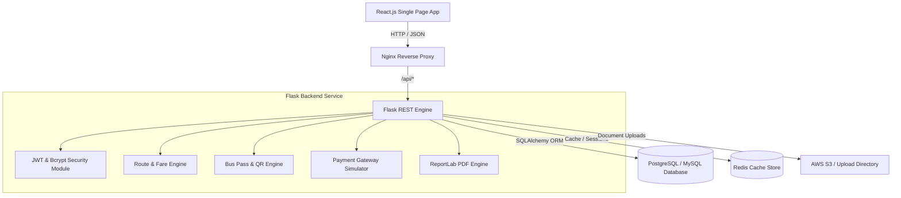

# System Architecture & Design Specification

## System Overview

The **Cloud-Based Bus Pass Management System** follows a decoupled, stateless microservices-ready architecture:

- **Frontend Tier**: React.js SPA (built with Vite), styled using custom modern transit dashboard tokens with Dark/Light glassmorphic theme.
- **API Engine**: Python Flask REST API with Blueprint modularity and CORS enabled.
- **Security Layer**: Stateless JWT authentication, Bcrypt password encryption, server-side parameter sanitization.
- **QR & PDF Engine**: Server-side QR generator returning PNG Data URLs and ReportLab PDF document compilation.
- **Persistence Layer**: SQLAlchemy ORM backing PostgreSQL/MySQL with Redis cache integration.

---

## Component Diagram (Mermaid)

---

## Key Reliability & Security Features

1. **Stateful vs Stateless Isolation**: The API layer stores no local session state in memory; all authentication tokens are self-contained JWT tokens.
2. **Automated QR Verification**: Every generated QR code encodes a verification payload that can be validated by transit inspectors via smartphone scanners.
3. **Audit Trail**: High-risk actions (pass approvals, route edits, login attempts) are automatically logged in `audit_logs` with IP metadata.
